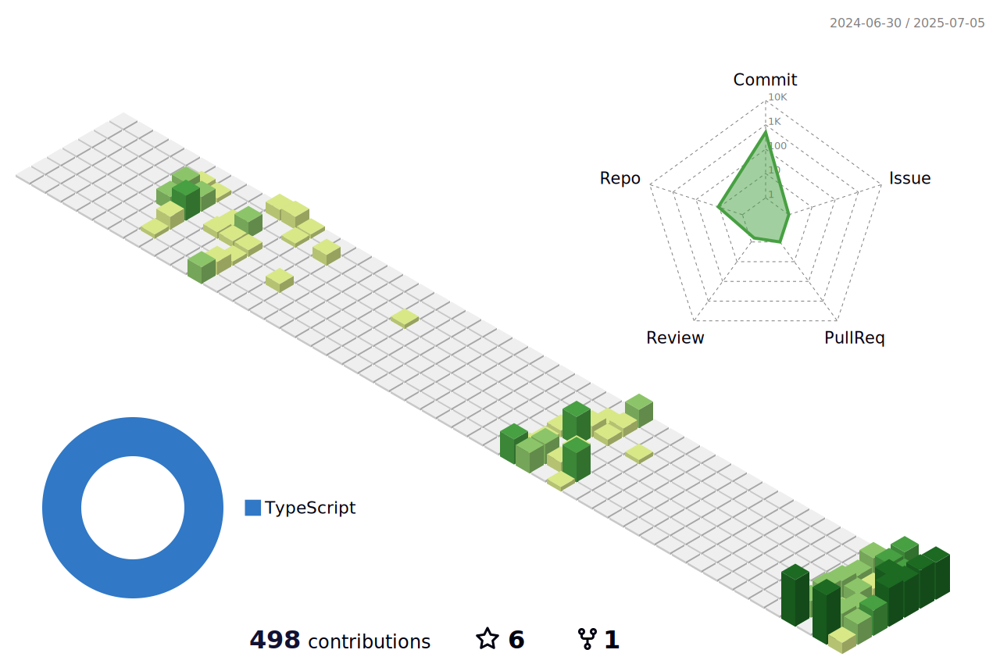

<p>


  <p>
    
    
    
    
    
    
    
    
    
    
    <br/>
    
    
    
    
    
    
  </p>
</p>
<p>
  📣 Besoin de me contacter ? Retrouvez-moi ici :<br/>
  <a href="mailto:contact@daniels-roth-stan.fr?subject=[GitHub]%20🔥%20Prise%20de%20contact&body=Bonjour%20Stan%2C%0A%0AJe%20viens%20vers%20toi%20aujourd%27hui%20apr%C3%A8s%20avoir%20vu%20ton%20profil%20GitHub%20pour%20..."></a>
  <a href="https://instagram.com/mrstandu33"></a>
  <a href="https://twitch.tv/mrstandu33"></a>
  <a href="https://linkedin.com/in/stan-daniels-roth-278478127"></a>
  <a href="https://twitter.com/mrstandu33"></a>
</p>
<p>
  🎶Now playing ...🎶<br/>
  <a href="http://spotify-informer.daniels-roth-stan.fr/">
    
  </a><br/>
  <a href="https://github.com/MrStanDu33/spotify-informer"></a><br/>
</p>


<h3>⚡️ Partenaire de vos projets ⚡️</h3><br/>
<p>
  🧔 Moi c'est <bold>Stan</bold>. 23 ans, barbu et un amateur de code et de 🍺.<br/>
  💼 J'habite à <a href="https://www.google.com/maps?q=bordeaux">Bordeaux</a>, en France.<br/>
  💻 Développeur Web <bold>T-Shaped</bold><em>(<a href="https://letslearnabout.net/blog/what-it-is-a-t-shaped-developer-and-why-you-should-be-one">?</a>)</em> <bold><a href="https://vuejs.org">Vue.js</a></bold> × <bold><a href="https://laravel.com">Laravel</a></bold>.<br/>
  🎥 Je fais de temps en temps des lives sur <a href="https://twitch.tv/mrstandu33">Twitch</a>, vous pourrez me voir développer des projets Open Source. <br/>
  🎓 Mentor sur la plateforme <a href="https://github.com/OpenClassrooms">@OpenClassrooms</a> depuis 4 ans
</p>
<p>
  🔗 Vous souhaitez me contacter ? Alors envoyez-moi un <a href="mailto:contact@daniels-roth-stan.fr?subject=[GitHub]%20🔥%20Prise%20de%20contact&body=Bonjour%20Stan%2C%0A%0AJe%20viens%20vers%20toi%20aujourd%27hui%20apr%C3%A8s%20avoir%20vu%20ton%20profil%20GitHub%20pour%20...">mail</a>, ou passez par mon <a href="https://daniels-roth-stan.fr">site</a> !
</p><br/>



<details>
  <summary>Quelques statistiques ...</summary><br/>

<!--START_SECTION:waka-->


**🐱 My GitHub Data** 

> 🏆 127 Contributions in the Year 2023
 > 
> 📦 763.7 kB Used in GitHub's Storage 
 > 
> 🚫 Not Opted to Hire
 > 
> 📜 16 Public Repositories 
 > 
> 🔑 30 Private Repositories  
 > 
**I'm an Early 🐤** 

```text
🌞 Morning    156 commits    ███░░░░░░░░░░░░░░░░░░░░░░   14.94% 
🌆 Daytime    411 commits    █████████░░░░░░░░░░░░░░░░   39.37% 
🌃 Evening    404 commits    █████████░░░░░░░░░░░░░░░░   38.7% 
🌙 Night      73 commits     █░░░░░░░░░░░░░░░░░░░░░░░░   6.99%

```
📅 **I'm Most Productive on Sunday** 

```text
Monday       126 commits    ███░░░░░░░░░░░░░░░░░░░░░░   12.07% 
Tuesday      168 commits    ████░░░░░░░░░░░░░░░░░░░░░   16.09% 
Wednesday    203 commits    ████░░░░░░░░░░░░░░░░░░░░░   19.44% 
Thursday     173 commits    ████░░░░░░░░░░░░░░░░░░░░░   16.57% 
Friday       61 commits     █░░░░░░░░░░░░░░░░░░░░░░░░   5.84% 
Saturday     81 commits     ██░░░░░░░░░░░░░░░░░░░░░░░   7.76% 
Sunday       232 commits    █████░░░░░░░░░░░░░░░░░░░░   22.22%

```


📊 **This Week I Spent My Time On** 

```text
⌚︎ Time Zone: Africa/Cairo

💬 Programming Languages: 
TypeScript               6 hrs 56 mins       ███████████████░░░░░░░░░░   61.78% 
Go                       1 hr 42 mins        ███░░░░░░░░░░░░░░░░░░░░░░   15.15% 
Python                   1 hr 6 mins         ██░░░░░░░░░░░░░░░░░░░░░░░   9.83% 
YAML                     40 mins             █░░░░░░░░░░░░░░░░░░░░░░░░   6.07% 
JSON                     20 mins             ░░░░░░░░░░░░░░░░░░░░░░░░░   3.07%

🔥 Editors: 
VS Code                  11 hrs 13 mins      █████████████████████████   100.0%

💻 Operating System: 
Windows                  11 hrs 13 mins      █████████████████████████   100.0%

```

**I Mostly Code in JavaScript** 

```text
JavaScript               26 repos            █████████████░░░░░░░░░░░░   54.17% 
TypeScript               12 repos            ██████░░░░░░░░░░░░░░░░░░░   25.0% 
HTML                     6 repos             ███░░░░░░░░░░░░░░░░░░░░░░   12.5% 
PHP                      2 repos             █░░░░░░░░░░░░░░░░░░░░░░░░   4.17% 
Kotlin                   1 repo              ░░░░░░░░░░░░░░░░░░░░░░░░░   2.08%

```


 Last Updated on 27/01/2023 00:05:30 UTC
<!--END_SECTION:waka-->
</details>
